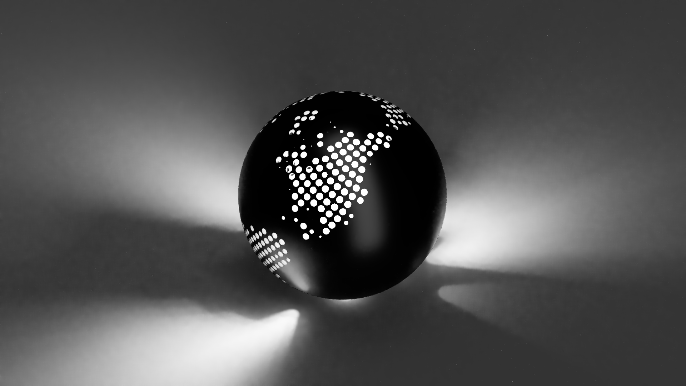
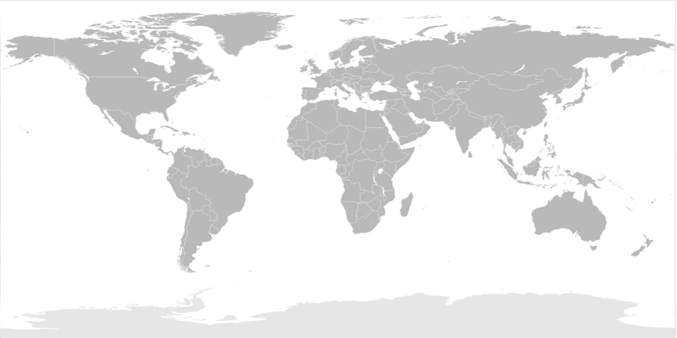
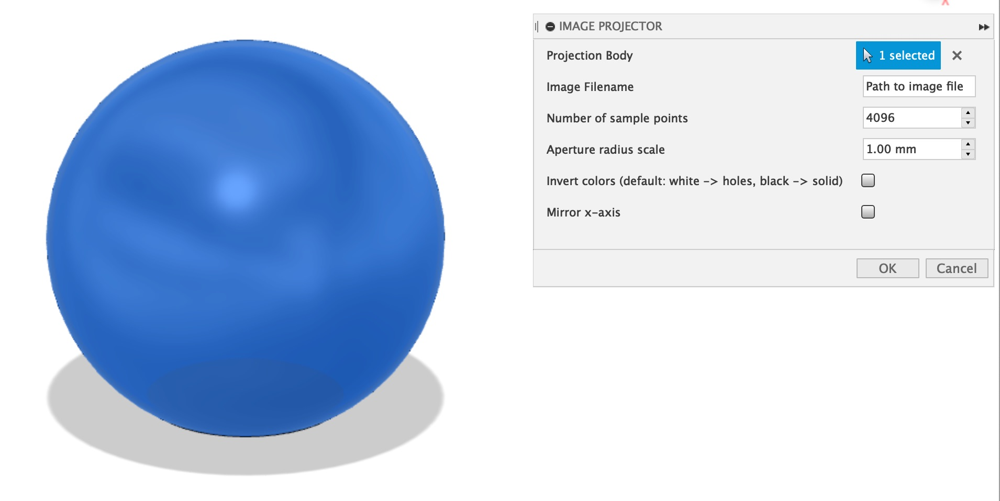
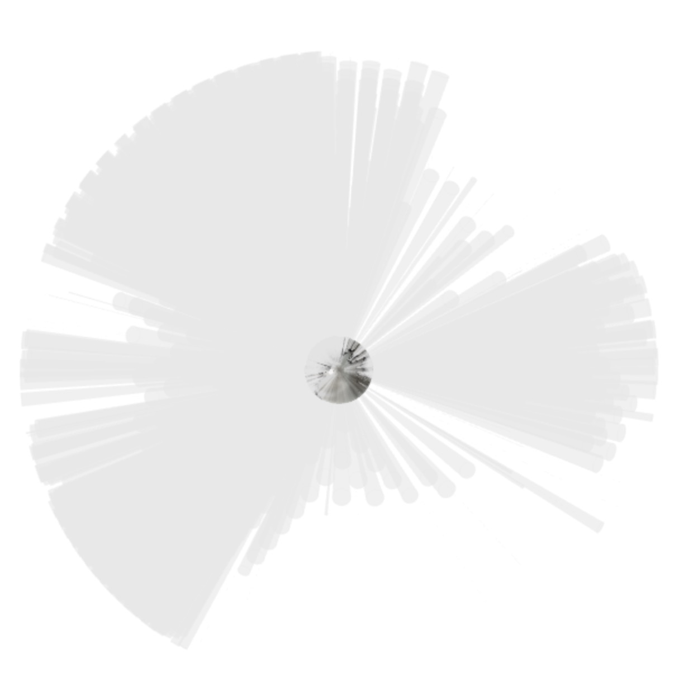
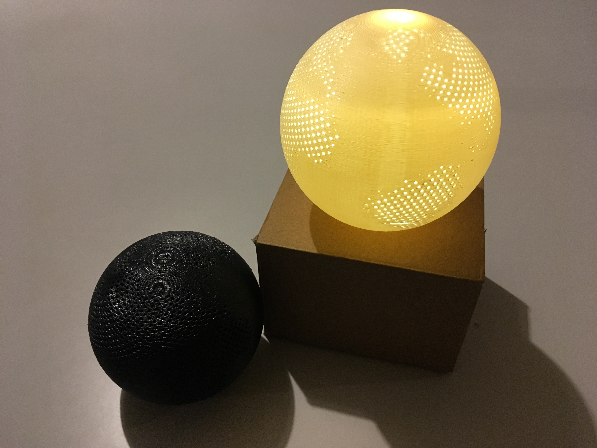
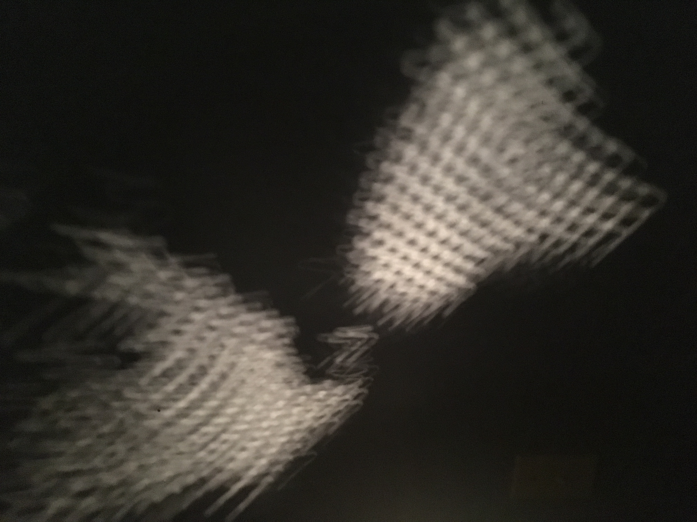

# Make pinhole lanterns in Fusion 360!
This add-in generates pinhole lanterns from spherical images.

<p align="center"></p>

The add-in takes a solid body and an equirectangular image file like this:
<p align="center"></p>

It processes the image and cuts projection pinholes into the target body to make it project the image in a globe.

I made this as my final project for [Digital Fabrication](https://laney.edu/carpentry/digital-fabrication/) at Laney College in fall 2019.

## Usage
The add-in interface is shown here:
<p align="center"></p>

Parameters:
  - Projection Body: the target body that will be cut into
  - Image Filename: an absolute path to an image file
  - Number of sample points: the number of vertices on our sphere
  - Invert colors: by default, the add-in treats cuts holes in the white parts of images (which are treated as bright). Check to invert this.
  - Aperture radius scale: a value between 0 and 1 that varies the size of projection holes.
  - Mirror x-axis: selecting this will make the lantern's surface inverted, making it project the 360" image correctly.

The render shown above has invert colors and mirror x-axis enabled (so that it projects the dark parts of the input image out in the correct orientation).

### A note for Mac OS users
[Changes to system transparency / privacy policy control](https://apple.stackexchange.com/questions/395631/allow-all-applications-to-access-desktop-documents-and-downloads-in-catalina) may prevent the add-in from loading images on your Desktop / home directory (on Catalina and above). You'll need to update your system preferences (see StackOverflow link), or move your images to a project directory elsewhere.

## Installation
This is a Python add-in, and will be run using the Python interpreter that comes with your version of Fusion 360.

Start by copying / cloning the add-in into your Fusion 360 scripts folder. For me (on MacOS), this is: `/Users/<username>/Library/Application Support/Autodesk/Autodesk Fusion 360/API/Scripts/`

There are a few dependencies, which are listed in `requirements.txt`. These dependencies are assumed to be in a folder named "packages", in the add-in root directory, and are added to sys.path manually when the add-in starts:
```python
script_abspath = pathlib.Path(__file__).parent.absolute()
packagepath = os.path.join(script_abspath, "packages")
if packagepath not in sys.path:
    sys.path.append(packagepath)
```

To install them, start by determining the version of Python Fusion 360 uses. There's more about this at [Mod the Machine](https://modthemachine.typepad.com/my_weblog/2019/09/debug-fusion-360-add-ins.html).

Next, set up a virtual environment with the same version (I recommend using [venv](https://docs.python.org/3/library/venv.html) or similar), navigate into the ImageProjector folder, and use pip to install the dependencies into the packages folder:
```bash
pip install --target packages -r requirements.txt
```

Finally, open up the Fusion 360 add-in menu and check that ImageProjector is there.

### Assumptions
This add-in is pretty rough, and makes some assumptions:
  1. There's exactly one point light source and its centered at the origin (0, 0, 0).
  2. The target body will be less than 48 "units" in size
  3. The projection will be spherical, and the image will be treated as a spherical image. Be sure to provide one that is equirectangular (should have width double its height). 
  4. The image will be processed as a grid of 16384 tiles. For more on this, check out the [Mercantile documentation](https://mercantile.readthedocs.io/en/latest/quickstart.html).

Please feel very free to edit the add-in script, or to submit PRs with changes / quality-of-life improvements if you find this useful!

## Procedure
The script iterates around a sphere using a [Fibonacci lattice](https://observablehq.com/@mbostock/spherical-fibonacci-lattice). This lets us space our points more-or-less evenly (at least compared to naively iterating by latitude/longitude, which leads to too many holes near the top of the projection sphere, and too few around the equator).

At each vertex, the add-in computes the average luminosity of the corresponding area in the provided image. It then generates a tool body (cone) with radius proportional to the luminosity.

Finally, it takes the union of the tool bodies and executes a combine (cut) against the selected target body. Here's a picture of the generated tools in action:
<p align="center"></p>

## Results

I spent a lot of time tweaking settings and generating .stl files. Generating too many holes blows up the filesize (which can crash printer slicing software), but too few makes for really low resolution on the sphere. I found ~8000 samples to be appropriate for the globe lamps here. Making the aperture size too small makes the holes difficult to print.

Here are the final prints of the globe lamp! I made these at the [Laney Fab Lab](https://laney.edu/fablab/) on a Stratasys Mojo 3D printer.
<p align="center"></p>

The print in thin white ABS has a really nice glowing effect, while image projection works **much** better with darker colors:
<p align="center"></p>

With a small enough aperture size each hole acts as a pinhole projector, casting an image of the bulb filament out of the lantern. It's a neat effect, and was totally unintended going into this.
<p align="center"></p>

The effect is present for apertures with diameter between 0.01 and 0.05 inches, with smaller pinholes generally producing clearer images.

In future runs, I'd like to try playing around with printing silhouettes (e.g. projecting the water on the globe and leaving the land as shadow).
